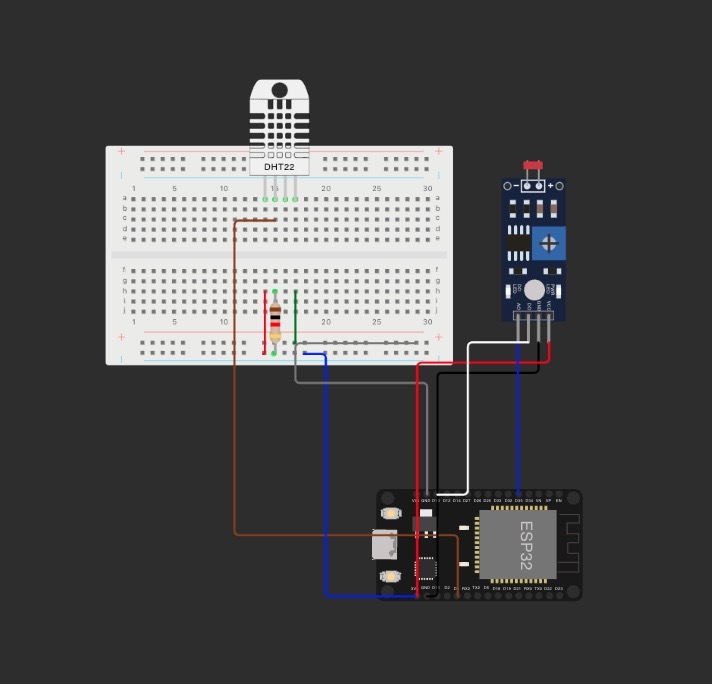

# Checkpoint 5 - Edge Computing

Este é um programa para o ESP32 que permite controlar um LED onboard e enviar informações de telemetria para um broker MQTT. Ele também lê a temperatura e um sensor de luminosidade e publica os dados relevantes no broker MQTT.

## Funcionalidades

- Controle de ligar/desligar um LED onboard via MQTT.
- Leitura da temperatura e um sensor de luminosidade.
- Publicação dos dados de telemetria no broker MQTT.
- Reatividade a comandos MQTT para controlar o LED.

## Configuração

Antes de usar este programa, você deve configurar algumas informações, como a rede Wi-Fi, o broker MQTT e os tópicos MQTT. Aqui estão os principais pontos de configuração:

### Informações de rede Wi-Fi

- SSID: Nome da rede Wi-Fi à qual o ESP32 deve se conectar.
- PASSWORD: Senha da rede Wi-Fi.

### Configuração do Broker MQTT

- BROKER_MQTT: URL do broker MQTT.
- BROKER_PORT: Porta para conexão com o broker MQTT.

### Tópicos MQTT

- TOPICO_SUBSCRIBE: Tópico MQTT usado para receber comandos para controlar o LED.
- TOPICO_PUBLISH: Tópico MQTT usado para publicar informações de telemetria.
- TOPICO_PUBLISH_2: Tópico MQTT adicional para publicar informações de luminosidade.

## Uso

1. Configure as informações de rede Wi-Fi e do broker MQTT no código.
2. Carregue o código para o seu ESP32 usando a IDE Arduino ou outro ambiente compatível.
3. Observe o monitor serial para depurar informações.
4. Use um cliente MQTT para enviar comandos para o tópico `TOPICO_SUBSCRIBE` para controlar o LED.
5. Monitore os tópicos `TOPICO_PUBLISH` e `TOPICO_PUBLISH_2` para obter informações de telemetria.

## Circuito - Funcionamento e modelo

### Funcionamento

Neste circuito é apresentado o ESP32 ligado a um sensor de luz o LDR e um sensor de umidade o DHT11, ambos tem a função de calcular e monitorar, dentro do ambiente no qual se encontram. Ambos também podem ser controlados a base do servidor MQTT, Python Requests ou mesmo por meio do Wokwi, já que é possível mudar os números de temperatura, luz, umidade e dentro outros.

## Paho MQTT

O arquivo python se conecta com o mqtt, por meio da dependência paho-mqtt, que consegue chamar os tópicos e por exemplo liga e desligar o led por linhas de comando.

